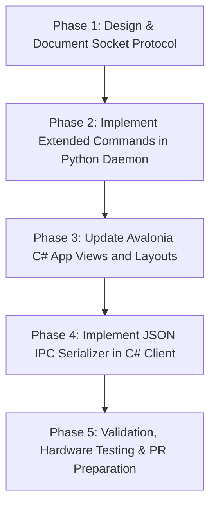

# Proposal: Extending Keyboard RGB Capabilities inside DAMX (Div Acer Manager Max)

This document outlines the architectural plan, technical intention, and step-by-step roadmap for extending the keyboard RGB control capabilities inside DAMX.

---

## 1. Context & Motivation

DAMX currently serves as a unified control panel for Acer laptops on Linux, consolidating features like fan curves, battery charge limiters, power/thermal profiles, and basic keyboard lighting. 

However, the current keyboard lighting interface in DAMX is relatively simple compared to what the underlying hardware (and alternative kernel modules like Jafar Akhondali's `facer.ko` extras driver) can offer. Features such as granular 4-zone coloring, customizable animation speeds, directions, and advanced effects (Breathing, Neon, Wave, Shifting, Zoom) are either not fully exposed in the UI or restricted by the current driver assumptions.

Rather than replacing or forking DAMX, our **intention** is to extend DAMX to become the central, definitive place to configure all Acer laptop features on Linux. To achieve this, we will enhance both the GUI and the Daemon backend to support an extended RGB capability protocol.

---

## 2. Target Objectives

1. **Granular Zone Selection:** Allow user-defined colors for each of the 4 zones independently in static mode.
2. **Extended Lighting Patterns:** Introduce support for Shifting, Zoom, Neon, and customizable Breathing speeds.
3. **Abstract Driver Layer:** Ensure the Daemon can dynamically translate these high-level RGB instructions regardless of which kernel driver is active (e.g., standard `linuwu_sense` vs. other reverse-engineered alternatives).
4. **Enhanced Desktop GUI:** Update the layout to support these extended settings seamlessly (combining speed sliders, direction selectors, and interactive zone toggles).

---

## 3. Current System Analysis & Bridging Plan

### Daemon-GUI Communication (IPC)
Currently, the Avalonia C# GUI communicates with the Python Daemon via a local Unix Domain Socket at:
`/var/run/DAMX.sock`

The GUI sends JSON packets containing a `command` and a dictionary of `params`. The daemon dispatches this in `process_command()`.

### Backend Driver Writes
The Daemon currently interacts with the `linuwu_sense` driver interface using the following sysfs paths:
* **Per-Zone Static Color:**
  `/sys/module/linuwu_sense/drivers/platform:acer-wmi/acer-wmi/four_zoned_kb/per_zone_mode`
  *Format written:* `zone1_hex,zone2_hex,zone3_hex,zone4_hex,brightness\n` (e.g. `34d399,f43f5e,3b82f6,a855f7,100`)
* **Four-Zone Effect Mode:**
  `/sys/module/linuwu_sense/drivers/platform:acer-wmi/acer-wmi/four_zoned_kb/four_zone_mode`
  *Format written:* `mode,speed,brightness,direction,red,green,blue\n` (e.g. `3,4,100,1,52,211,153`)

---

## 4. Proposed Extension Architecture

We will implement an extended command structure over the Unix socket.

### A. Extended JSON API Protocol (Socket IPC)

```json
{
    "command": "set_extended_rgb",
    "params": {
        "mode": 0,
        "brightness": 100,
        "speed": 4,
        "direction": 1,
        "zones": {
            "1": {"r": 52, "g": 211, "b": 153},
            "2": {"r": 244, "g": 63, "b": 94},
            "3": {"r": 59, "g": 130, "b": 246},
            "4": {"r": 168, "g": 85, "b": 247}
        },
        "globalColor": {
            "r": 52,
            "g": 211,
            "b": 153
        }
    }
}
```

### B. Daemon Logic Adaptation (`DAMX-Daemon.py`)

1. Add the `set_extended_rgb` command dispatch inside `process_command()`.
2. Inspect the parameters and determine which sysfs node to update:
   * **If Mode is 0 (Static):** Map the 4-zone RGB colors to their hexadecimal strings and write to `/four_zoned_kb/per_zone_mode`.
   * **If Mode is 1-5 (Dynamic):** Map the selected dynamic mode index, speed, brightness, direction, and target color to `/four_zoned_kb/four_zone_mode`.

---

## 5. Step-by-Step Implementation Plan



### Phase 1: Socket Protocol Design (This Branch Init)
* Document the exact payloads.
* Outline fallback mechanisms if certain features are not supported by the hardware.

### Phase 2: Daemon Command Extension (`DAMM-Daemon/`)
* Edit `DAMX-Daemon.py` to add `set_extended_rgb`.
* Add parameter validation (ensuring speed is 0–9, brightness 0–100, direction 1–2).
* Ensure proper exception logging if write permissions to the `/sys` filesystem are denied.

### Phase 3: GUI View Layout Updates (`DivAcerManagerMax/`)
* Modify the Avalonia `.axaml` files to add controls for:
  * Speed Slider (0-9).
  * Flow Direction (Toggle Switch/Segmented Buttons).
  * Color selections per zone (visualized in a keyboard grid).

### Phase 4: Client IPC Implementation (`DAMXClient.cs`)
* Integrate C# serialization structures matching the extended JSON schema.
* Bind the C# events from the GUI elements to automatically push socket updates on slider release/color selection.

### Phase 5: Verification & Integration Testing
* Launch the Python daemon in debug/verbose mode.
* Launch the Avalonia GUI.
* Verify socket connection and ensure the `/sys` file variables are updated with correct values.
